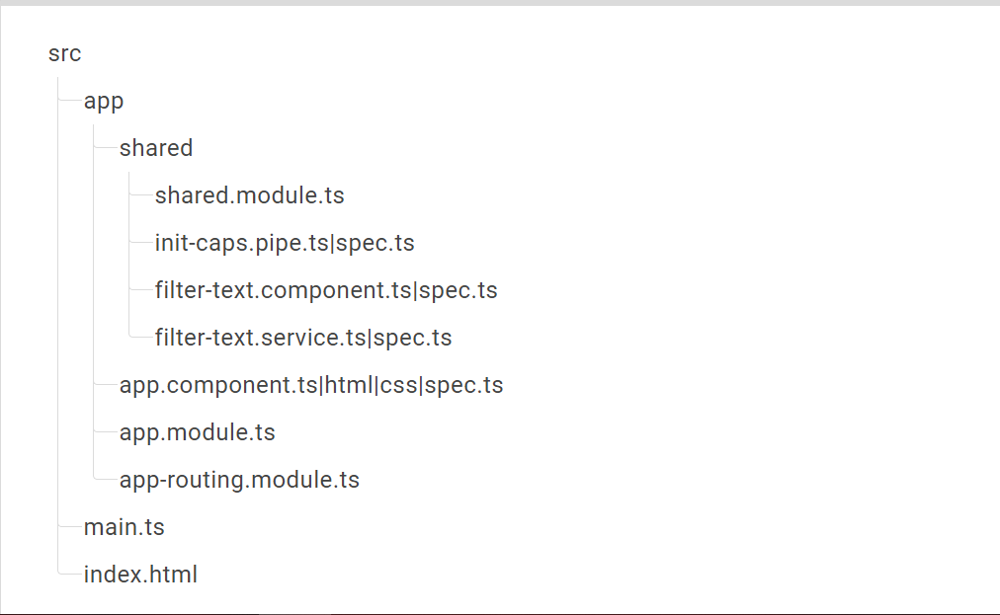

# MotorcycleWorkshop

## Este proyecto es una aplicación Angular con una estructura de carpetas organizada para facilitar el desarrollo y mantenimiento del código.

### Estructura de Carpetas
La estructura de carpetas del proyecto es la siguiente:

    -app
      -shared
        -services
        -pipes
        -components
        -models
      
      -modules
        -users
          -components
            -list
            -edit
          -models
          -users.model.ts
          -services
          -user-service.ts
          users.component.ts // Este componente actúa como un componente contenedor inteligente
          users.component.html
          users.module.ts
          users.route.ts
        -organisations
          -components
            -list
            -manage
          -models
            organisation.model.ts
          -services
            organisation.service.ts
          organisations.component.ts // Este componente actúa como un componente contenedor/inteligente
          organisations.component.html
          organisations.module.ts
          organisations.route.ts
        
    -app.component.ts
    -app.component.html
    -app.module.ts
    -app-routing.module.ts

## Descripción de Carpetas y Archivos
### app 
* app.component.ts: Componente principal de la aplicación.
* app.component.html: Plantilla HTML del componente principal.
* app.module.ts: Módulo principal de la aplicación.
* app-routing.module.ts: Módulo de enrutamiento principal de la aplicación.
### shared
* services: Contiene servicios compartidos que pueden ser utilizados en toda la aplicación.
* pipes: Contiene pipes personalizados compartidos.
* components: Contiene componentes compartidos que pueden ser reutilizados en diferentes partes de la aplicación.
* models: Contiene modelos compartidos que representan las estructuras de datos utilizadas en la aplicación.
### modules
### users
* components
  - list: Componente para listar usuarios.
  - edit: Componente para editar usuarios.
* models
  - users.model.ts: Modelo que representa la estructura de datos de un usuario.
* services
  - user-service.ts: Servicio para manejar la lógica de negocio relacionada con los usuarios.
  - users.component.ts: Componente contenedor/inteligente para la funcionalidad de usuarios.
  - users.component.html: Plantilla HTML del componente de usuarios.
  - users.module.ts: Módulo de usuarios.
  - users.route.ts: Configuración de rutas para el módulo de usuarios.
## organisations
* components
  - list: Componente para listar organizaciones.
  - manage: Componente para gestionar organizaciones.
* models
  - organisation.model.ts: Modelo que representa la estructura de datos de una organización.
* services
  - organisation.service.ts: Servicio para manejar la lógica de negocio relacionada con las organizaciones.
  - organisations.component.ts: Componente contenedor/inteligente para la funcionalidad de organizaciones.
  - organisations.component.html: Plantilla HTML del componente de organizaciones.
  - organisations.module.ts: Módulo de organizaciones.
  - organisations.route.ts: Configuración de rutas para el módulo de organizaciones.
